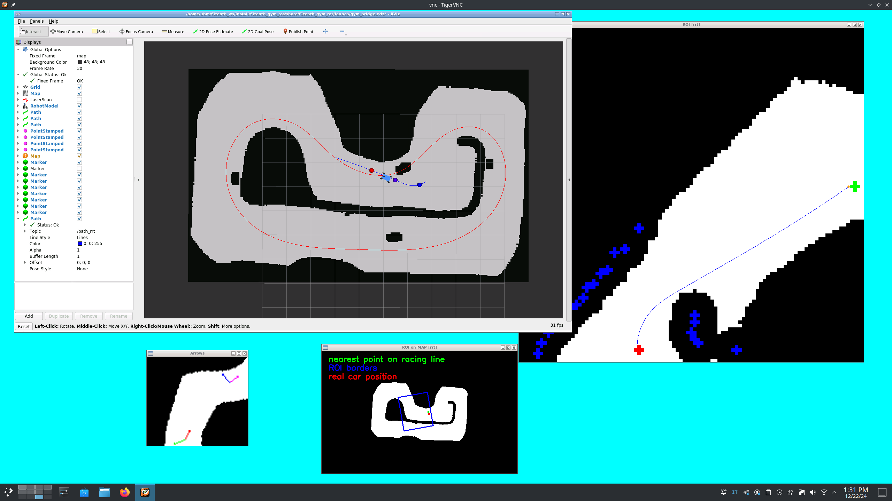

# ubm-rrt

This files can be directly copied into `ubm-f1tenth` to make the package work as of 12/22/2024. To automatically build it in the docker container, you would have to add the link in the `~/f1tenth_ws/src` folder as usual.

Since the package is not maintained anymore, documentation will not be updated according to UEP 11.



## Build C++ dependencies

This package has some C++ dependencies that are exclusive to the `rrt` package: GEOS, FLANN and nanoflann. Armadillo is another one but it is present also in other packages, so it won't be necessary to rebuild it.

We assume this dependencies have to be built within the docker container.

### GEOS 3.12.1

```bash
cd /home/ubm && \
wget https://github.com/libgeos/geos/releases/download/3.12.1/geos-3.12.1.tar.bz2 && \
tar xvfj geos-3.12.1.tar.bz2 && \
cd geos-3.12.1 && \
mkdir _build && cd _build && \
cmake -DCMAKE_BUILD_TYPE=Release -DCMAKE_INSTALL_PREFIX=/usr/local .. && \
make -j12 && ctest && make install
```

### FLANN 1.9.2

```bash
cd /home/ubm && \
curl -L https://github.com/flann-lib/flann/archive/refs/tags/1.9.2.tar.gz > flann.tar.gz && \
tar xf flann.tar.gz && \
cd flann-1.9.2 && \
mkdir build && cd build && \
cmake -DCMAKE_INSTALL_PREFIX=/usr/local -DBUILD_C_BINDINGS=OFF -DBUILD_PYTHON_BINDINGS=OFF \
      -DBUILD_MATLAB_BINDINGS=OFF -DBUILD_EXAMPLES=OFF -DBUILD_TESTS=OFF -DBUILD_DOC=OFF .. && \
make -j12 && make install
```

### nanoflann v1.6.2

```bash
cd /home/ubm && \
curl -L https://github.com/jlblancoc/nanoflann/archive/refs/tags/v1.6.2.tar.gz > nanoflann.tar.gz && \
tar xf nanoflann.tar.gz && \
cd nanoflann-1.6.2 && \
mkdir build && cd build && \
cmake -DCMAKE_INSTALL_PREFIX=/usr/local .. && \
make -j12 && make install
```
